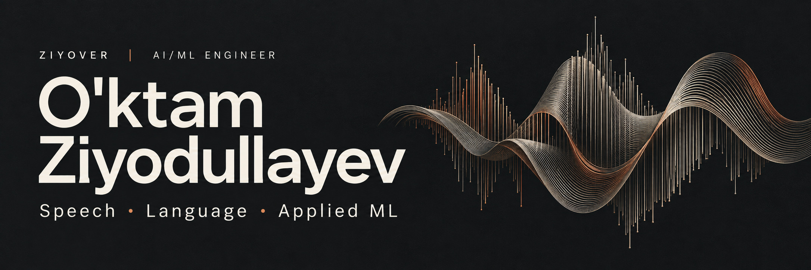

  

# O'ktam Ziyodullayev

**AI/ML Engineer · Speech & Language AI · Applied Machine Learning**

I build speech and language applications, with a focus on Uzbek ASR, dataset quality, real-time audio, and tools for AI coding assistants. My work connects model experiments with the interfaces and data systems needed to use them.

[Email](mailto:uktamziyodullayev189@gmail.com) · [Projects](https://github.com/ZiyoVer?tab=repositories)

## Selected work

| Project | What it does | Engineering focus |
| :--- | :--- | :--- |
| **[projmap](https://github.com/ZiyoVer/projmap)** | Compact codebase maps, symbol lookup, and persistent project notes for coding assistants. | Python · AST parsing · MCP |
| **[Uzbek Whisper Fine-Tuning](https://github.com/ZiyoVer/uzbek-whisper-finetuning)** | Experimental ASR training with speaker balancing, text preprocessing, and WER/CER evaluation. | PyTorch · Transformers · Uzbek ASR |
| **[Speech Dataset Review](https://github.com/ZiyoVer/speech-dataset-review)** | Telegram and web tools for reviewing recordings, correcting transcripts, and organizing accepted samples. | TypeScript · PostgreSQL · S3 |
| **[Uzbek Call-Center LoRA](https://github.com/ZiyoVer/uzbek-callcenter-finetuning)** | Assistant-only fine-tuning with validated dialogue splits, checkpoint resume, and base-versus-adapter evaluation. | PyTorch · PEFT · Uzbek LLMs |
| **[DTMMax](https://github.com/ZiyoVer/dtmmax)** | An Uzbek exam-preparation platform with AI chat, tests, flashcards, and teacher workflows. | React · Express · Prisma · LLM APIs |
| **[MiniMax H3 Studio](https://github.com/ZiyoVer/minimax-h3-studio)** | An Uzbek film-production workspace with storyboards, reference frames, and a serial ComfyUI render queue. | Python · JavaScript · ComfyUI |

Additional resources: [Uzbek STT utilities](https://github.com/ZiyoVer/uzbek-stt) · [Live Translator downloads](https://ziyover.github.io/trk1-site/)

## Technical focus

- **Speech and ML:** Whisper, PyTorch, Hugging Face Transformers, audio preprocessing, and recognition error analysis.
- **Language models:** assistant-only LoRA fine-tuning, retrieval-augmented workflows, streaming voice interfaces, and MCP integrations.
- **Video generation:** ComfyUI workflow integration, storyboards, reference frames, and local render queues.
- **Product engineering:** Python, TypeScript, React, PostgreSQL, object storage, REST APIs, and WebSockets.

I am interested in making speech and language technology more useful for Uzbek-speaking users, improving datasets, and turning ML experiments into usable software.

For engineering opportunities or technical collaboration: **[uktamziyodullayev189@gmail.com](mailto:uktamziyodullayev189@gmail.com)**.
