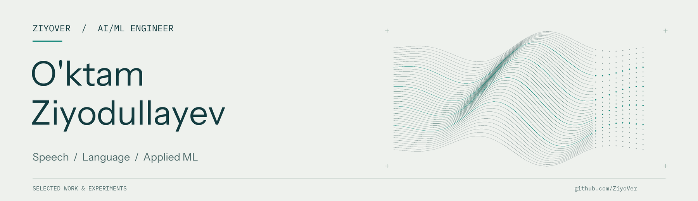

  

# O'ktam Ziyodullayev

**AI/ML Engineer · Speech & Language AI · Applied Machine Learning**

I work on speech recognition, language-model applications, and the engineering that connects models to usable software. My projects span Uzbek ASR experiments, speech-data review workflows, real-time audio systems, and developer tools for AI coding assistants.

[Email](mailto:uktamziyodullayev189@gmail.com) · [Explore my repositories](https://github.com/ZiyoVer?tab=repositories)

## Selected work

| Project | What I built | Engineering focus |
| :--- | :--- | :--- |
| **[Uzbek Whisper Fine-Tuning](https://github.com/ZiyoVer/FIne-tuning-)** | An experimental training pipeline for Uzbek speech recognition, with speaker balancing and WER/CER utilities. | PyTorch · Transformers · ASR evaluation |
| **[projmap](https://github.com/ZiyoVer/projmap)** | A Python CLI and MCP server that exposes compact codebase maps, symbol lookup, and persistent project notes to coding assistants. | AST parsing · Incremental indexing · MCP |
| **[Speech Dataset Review](https://github.com/ZiyoVer/for-CV)** | A Telegram and web workflow for reviewing audio, editing transcripts, and organizing accepted samples in object storage. | Data quality · PostgreSQL · S3 · TypeScript |
| **[Live Translator](https://github.com/ZiyoVer/trk1)** | A desktop voice-translation application with configurable audio routing, live captions, and streaming playback. | Python · Streaming audio · Desktop integration |

More experiments: [Uzbek STT utilities](https://github.com/ZiyoVer/uzbek-stt) · [AI Call Center prototype](https://github.com/ZiyoVer/hackathon)

## Technical focus

- **Speech & ML:** Whisper, PyTorch, Hugging Face Transformers, audio preprocessing, speaker balancing, and word/character error analysis.
- **Language-model systems:** LLM API integration, retrieval-augmented applications, real-time voice interfaces, and the Model Context Protocol.
- **Data & software engineering:** Python, TypeScript, PostgreSQL, S3-compatible storage, REST APIs, WebSockets, and Telegram bots.

## What interests me

Making speech and language technology more useful for Uzbek-speaking users, building better datasets, and carrying ML experiments through to applications people can use.

For engineering opportunities or technical collaboration, reach me at **[uktamziyodullayev189@gmail.com](mailto:uktamziyodullayev189@gmail.com)**.
